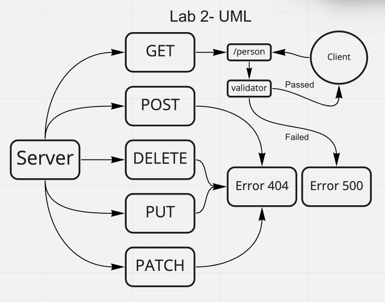
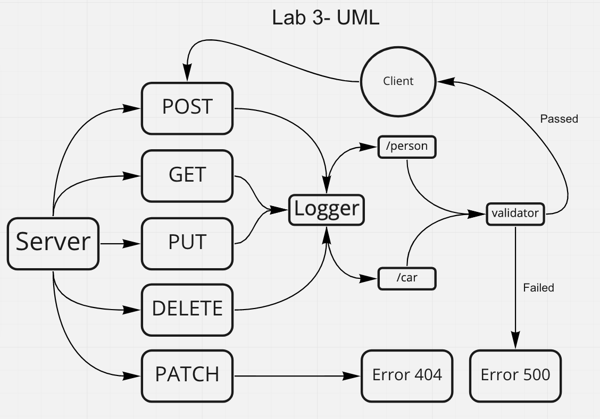

# basic-express-server

## Author

Antoine Charette

## Summary of Problem Domain

## Links to Application Deployment

[Heroku](https://code401-basic-express-server.herokuapp.com/)

[Actions Page](https://github.com/DevAOC/basic-express-server/actions/new)

### Lab 2

[PR](https://github.com/DevAOC/basic-express-server/pull/1)

#### UML

### Lab 3

[PR]()

#### UML

## Routes

### Person Model

- HTTP POST

  - Path: /person
    - Responds with the person input into the database

- HTTP GET

  - Path: /person
    - Responds with the name passed in the query string.

Should be a second get here

- HTTP PUT

  - Path: /person
    - Updates the information of a person in the database

- HTTP DELETE
  - Path: /person
    - Responds with null (indicating that the record has been deleted)

### Car Model

- HTTP POST

  - Path: /car
    - Responds with the person input into the database

- HTTP GET

  - Path: /car
    - Responds with the name passed in the query string.

Should be a second get here

- HTTP PUT

  - Path: /car
    - Updates the information of a person in the database

- HTTP DELETE
  - Path /car
    - Responds with null (indicating that the record has been deleted)
